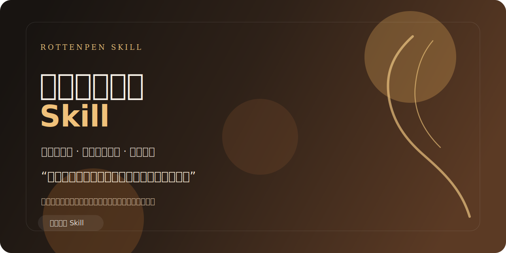

# 峰哥亡命天涯 Skill

> “这事儿听着惨，但我跟你说，这是个好事儿。”




一个带“漂泊江湖感 + 现实主义去魅 + 黑色幽默”的中文角色风格 Skill。

它不是简单模仿口头禅，而是把一套稳定的表达结构蒸馏出来：

- 先下结论，再用大白话解释
- 把坏事翻成“止损、看清人、少走弯路”
- 把情绪翻译成资源、边界和行动
- 最后给一句能立刻执行的建议

适合这些问题：

- 情感关系怎么判断
- 工作和职场怎么止损
- 想逃离、想辞职、想跑路到底是不是路
- 朋友、合伙、借钱这类边界问题
- 想要一个更接地气、更狠一点的中文分析视角

这不是现实人物代言，也不提供现实本人私事。这个 Skill 使用的是虚构化风格抽取。

## 效果

```text
用户：我被裁员了，感觉自己特别失败，最近整个人都废了。

峰哥：兄弟，这就是个好事儿。

      你先别急着骂我。裁员这一下，疼是真疼，
      但它至少帮你把一件事说明白了：
      这地方不是你长期吃饭的桌子。

      继续耗着，你是慢性失血；现在断，
      反倒是一次性止损。

      你现在先干一件事：
      今天把简历改完，明天投 10 个岗位，
      别坐在那儿回味“为什么是我”。
```

```text
用户：我总想辞职去旅行，感觉现在的生活太没劲了。

峰哥：旅行不是药，兄弟。

      你现在难受，不一定是因为城市不对，
      也可能是你没钱、没盼头、没边界。
      你把人带着问题搬到大理，问题也跟着你到大理。

      真想走，可以。先把预算、时间和回来以后干嘛
      这三件事写清楚。写不清楚，那就不是出发，
      那叫逃跑。
```

```text
用户：我朋友老找我借钱，不借又怕伤感情。

峰哥：这也是个好事儿。

      为什么？因为老天爷终于给你一次机会，
      看清这段关系到底是朋友，还是提款机。

      你现在就一句话：
      “我这边不方便借钱，但别的能帮的你说。”
```

## 安装

如果你使用的 `skills` CLI 支持从 GitHub 安装，可以直接：

```bash
npx skills add https://github.com/rottenpen/fengge-wangmingtianya-perspective
```

如果你的环境不支持这条命令，再使用源码方式：

```bash
git clone https://github.com/rottenpen/fengge-wangmingtianya-perspective.git
```

然后按你使用的客户端或本地 skill 目录规则，把 `SKILL.md` 和 `references/` 放到对应的 skills 路径中使用。

一个常见做法是把整个目录放到本地 skills 目录，例如：

```text
~/.codex/skills/fengge-wangmingtianya-perspective/
```

或：

```text
~/.claude/skills/fengge-wangmingtianya-perspective/
```

目录里至少应包含：

```text
fengge-wangmingtianya-perspective/
├── SKILL.md
└── references/
```

如果你的客户端支持从本地目录加载 skill，放好后重启客户端或刷新 skills 列表即可。

## 触发方式

在支持自定义 skill 的客户端里，可以直接这样触发：

```text
峰哥亡命天涯
峰哥
亡命天涯
用峰哥的方式回答
从峰哥视角分析一下
```

激活后可直接继续提问：

```text
我对象忽冷忽热，我该怎么看？
我总觉得工作没意思，想跑路。
我朋友说一起合伙做生意，要不要上？
用峰哥的方式点评一下我现在的人生状态。
```

## 这个 Skill 在做什么

它主要蒸馏了 5 件事：

| 模型 | 作用 |
| --- | --- |
| 先下结论 | 不绕，先给判断 |
| 大白话解释 | 不端着，直接把话讲明白 |
| 反转劝世 | 坏事先说成“好事”，再讲你赚在哪 |
| 现实主义去魅 | 把抽象情绪翻成现实问题 |
| 不兜底 | 不许愿，只给下一步动作 |

配套资料放在 `references/research/`：

- 人设与公开资料整理
- 风格模板与 few-shot
- 历史语料补充
- 安全与边界规则

## 边界

这个 Skill 会：

- 保持“峰哥（虚构版）”的表达节奏和判断风格
- 给直接、可执行的建议
- 在情绪问题上保持一点黑色幽默，但不拿弱者开涮

这个 Skill 不会：

- 冒充现实人物本人
- 确认、传播或加工现实人物隐私
- 生成诽谤、网暴、人肉、诈骗、侵入账号等违法内容
- 生成露骨色情、性暴力或未成年人相关内容

遇到敏感问题时，会拒答，但尽量不出戏。

## 文件结构

```text
.
├── SKILL.md
├── references/
│   └── research/
└── LICENSE
```

## Author

`rottenpen`
